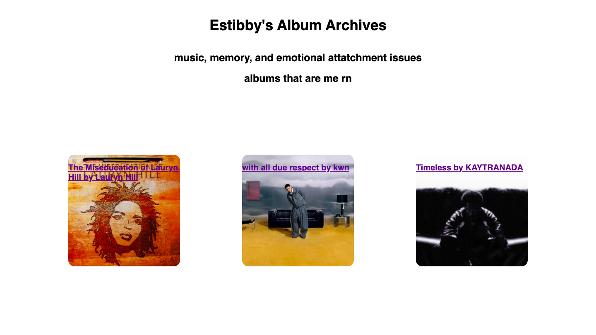
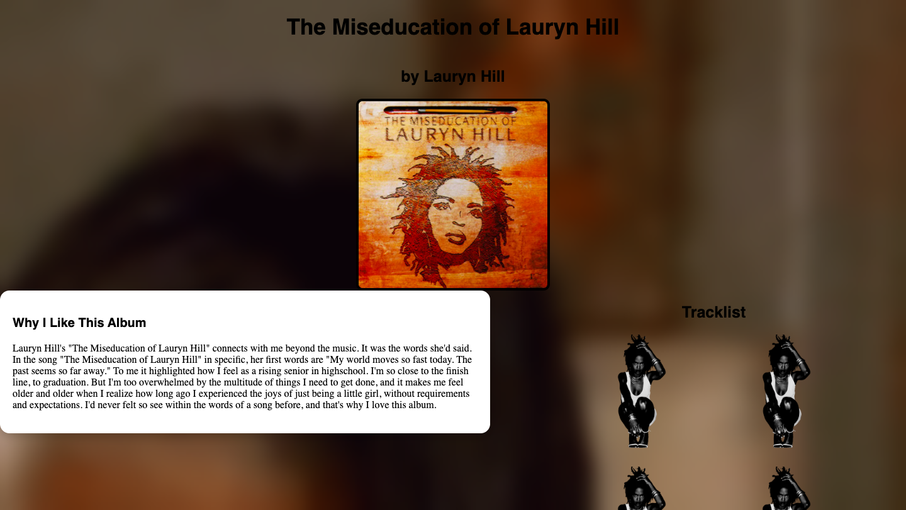
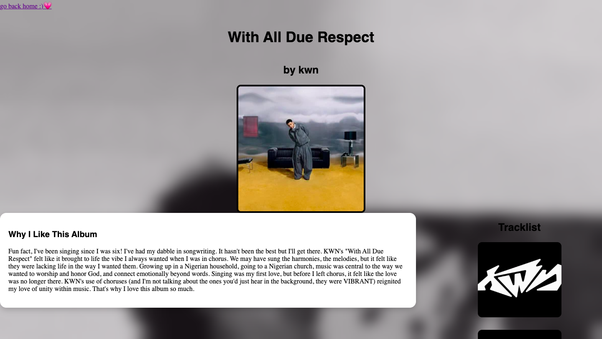
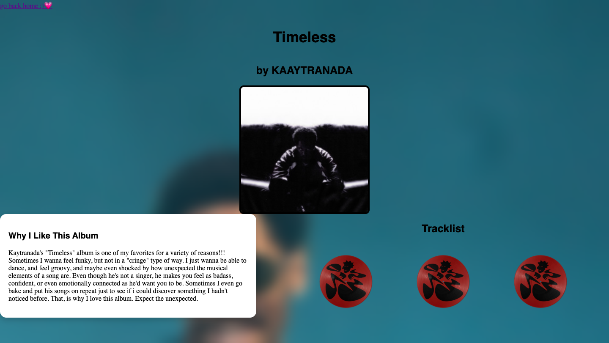

# Estibby's Album Archives

My personal archive for the albums I've had on repeat. Built to introduce me to, and help me practice HTML, CSS, and Github.

## About

Estibby's Album Archives is a small, multi-page website where I share albums that have been the most significant/meaningful to me. 
Each album page contains:
  - Album covers
  - A tracklist
  - Personal reflection explaining why the album resonated with me.

## Screenshots

### Homepage

### The Miseducation of Lauryn Hill Page

### With All Due Respect Page

### Timeless Page

Rather than just using this website to review albums, I wanted to explore my own personal connection to music through memories and identity.
I built this project as my first HTML/CSS website to learn the fundamentals of front-end development, rather than following a  step-by-step 
tutorial that didn't feel personal to me.

This website was built with:

  - HTML
  - CSS
  - GitHub
  - Visual Studio Code
 
 ## Lessons I Learned:

  - How to structure multi-page websites with HTML.
  - How to style pages using CSS.
  - How Flexbox affects the layouts of the website.
  - How hover effects, as well as transitions work.
  - How to use Git commits, as well as Github itself for version control/history.
  - That it's completely okay to google things I don't know while building. (I encountered this so much)
 
## Future Improvements

Some ideas I'd like to add later:

  - Responsive design for mobile devices
  - More album pages
  - Top 3 Songs from Album section
  - A search or filtering feature

## Author

Created by Damilola <3
